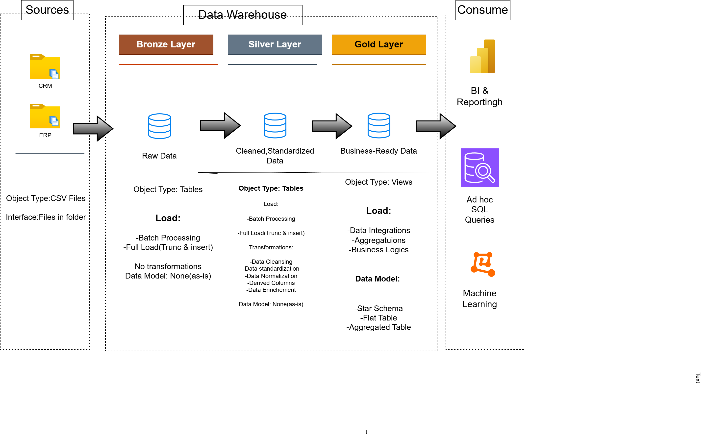

# 🚀 SQL Data Warehouse & Analytics Project

An end-to-end **SQL Server Data Warehouse** project that integrates data from **CRM** and **ERP** systems using the **Medallion Architecture (Bronze, Silver, Gold)**. The project demonstrates modern data engineering practices by building a scalable ETL pipeline and transforming raw operational data into business-ready datasets optimized for analytics and reporting.

---

# 📑 Table of Contents

* Project Overview
* Data Architecture
* Project Requirements
* Technologies & Tools
* Repository Structure
* Getting Started
* Future Improvements
* License

---

# 📖 Project Overview

This project demonstrates the complete lifecycle of building a modern SQL Data Warehouse.

### Key Highlights

* Designed a layered Data Warehouse using the Medallion Architecture.
* Built SQL-based ETL pipelines for data ingestion and transformation.
* Cleaned and standardized raw CRM and ERP datasets.
* Developed a dimensional model using Fact and Dimension tables.
* Created analytics-ready datasets for reporting and business intelligence.

---

# 🏗️ Data Architecture

The project follows the **Medallion Architecture**, separating raw, cleansed, and business-ready data into three logical layers.



## Bronze Layer

* Stores raw CRM and ERP datasets.
* Loads CSV files into SQL Server without transformations.
* Preserves source data for traceability.

## Silver Layer

* Cleanses, validates, and standardizes raw datasets.
* Removes duplicates and resolves data quality issues.
* Applies business transformation rules.
* Produces reliable datasets for downstream processing.

## Gold Layer

* Builds a dimensional model using Fact and Dimension tables.
* Organizes data into a Star Schema.
* Delivers analytics-ready datasets for reporting and dashboards.

---

# 🚀 Project Requirements

## 🎯 Project Vision

Design and implement a scalable SQL Server Data Warehouse that transforms raw operational data into a trusted analytical platform, providing a single source of truth for business intelligence and decision-making.

## 📌 Project Objectives

### 📥 Multi-Source Data Acquisition

* Import CRM and ERP datasets from CSV files.
* Establish a repeatable data ingestion process.

### 🧹 Data Quality Management

* Validate incoming data.
* Remove duplicates.
* Handle missing values.
* Standardize inconsistent formats.
* Improve overall data reliability.

### 🔄 Data Integration

* Combine CRM and ERP data into a unified warehouse.
* Apply business transformation rules.
* Build relationships between customers, products, and sales.

### 📊 Analytics-Oriented Data Modeling

* Design Fact and Dimension tables.
* Implement a Star Schema.
* Optimize analytical queries.
* Support Sales, Customer, Product, and Revenue analysis.

---

# 🛠️ Technologies & Tools

| Technology                          | Purpose                      |
| ----------------------------------- | ---------------------------- |
| SQL Server Express                  | Database Engine              |
| SQL Server Management Studio (SSMS) | Database Development         |
| SQL                                 | ETL & Data Transformation    |
| Git & GitHub                        | Version Control              |
| Draw.io                             | Architecture & Data Modeling |
| CSV                                 | Source Data                  |

---

# 📂 Repository Structure

```text
data-warehouse-project/
│
├── datasets/
│   ├── source_crm/
│   └── source_erp/
│
├── docs/
│   ├── datawarehouse-architecture.png
│   ├── data-flow.png
│   ├── data-model.png
│   ├──data-integration.png
│   
|
│
├── scripts/
│   ├── bronze/
│   ├── silver/
│   └── gold/
│
├── tests/
│
├── README.md
└── LICENSE
```

---

# 🚀 Getting Started

1. Clone the repository.
2. Open the project in SQL Server Management Studio.
3. Execute Bronze layer scripts.
4. Execute Silver layer scripts.
5. Execute Gold layer scripts.
6. Query the Gold layer for reporting and analytics.

---

# 🔮 Future Improvements

* Incremental data loading
* Slowly Changing Dimensions (SCD Type 2)
* SQL Agent scheduling
* Power BI Dashboard integration
* Data quality monitoring
* Automated ETL orchestration

---

# 📄 License

This project is licensed under the MIT License.
